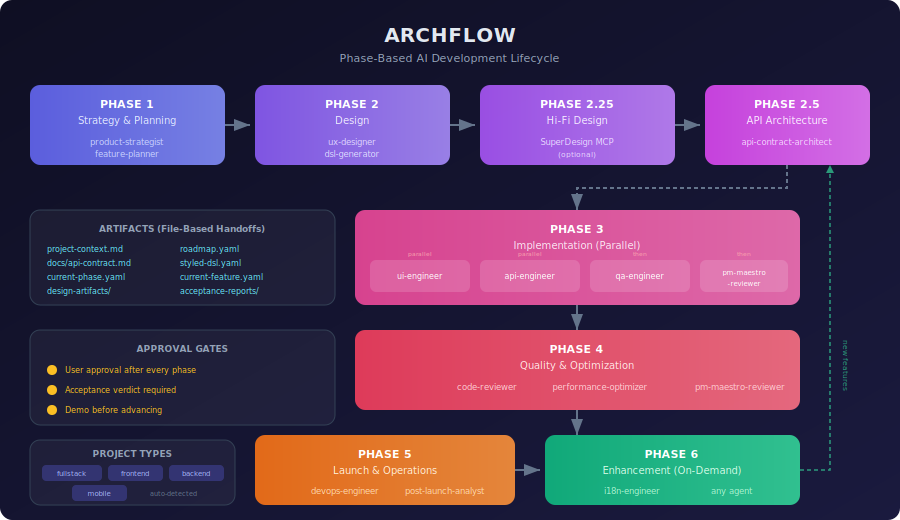

<div align="center">

# Archflow

**Turn Claude Code into a structured development team.**

[](https://opensource.org/licenses/MIT) [](https://docs.anthropic.com/en/docs/claude-code) [](https://github.com/AZidan/archflow) [](https://github.com/AZidan/archflow)

[Quick Start](#quick-start) · [What is Archflow?](#what-is-archflow) · [Phases](#the-phases) · [Agents](#agents) · [Commands](#slash-commands) · [Principles](#core-principles)



</div>

---

## What is Archflow?

Archflow is a **phase-based AI development framework** for [Claude Code](https://docs.anthropic.com/en/docs/claude-code) that orchestrates 16+ specialized agents through a rigorous workflow — from product strategy to production deployment.

Instead of one general-purpose AI doing everything, Archflow assigns each task to a dedicated agent with deep expertise in its domain: a `product-strategist` defines your business goals, a `ux-designer` creates your design system, an `api-contract-architect` locks down your API specs, and `ui-engineer` + `api-engineer` build the frontend and backend in parallel — all coordinated through file-based handoffs and mandatory approval gates.

Archflow works with any project type — fullstack, frontend-only, backend-only, or mobile — and adapts its phases, agents, and artifact structure accordingly. It supports onboarding existing codebases, importing context from external tools (Jira, Notion, Linear, GitHub), and managing feature development through a structured git branching workflow.

---

## Why Archflow?

Building software with AI assistants often means context gets lost, quality varies, and there's no consistent process. Archflow solves this by:

- **Phase gates with approval checkpoints** — No phase is skipped, no feature ships without verification
- **Specialized agents** — A UX designer doesn't write backend code; an API engineer doesn't make design decisions
- **Contract-first development** — API contracts are defined before implementation, enabling true parallel frontend/backend development
- **Token efficiency** — Dynamic phase loading means only relevant instructions are in context at any time
- **File-based handoffs** — Agents communicate through artifacts, not chat messages, so nothing gets lost

---

## The Phases

```
Phase 1    Strategy & Planning         product-strategist, feature-planner
Phase 2    Design                      ux-designer, dsl-generator
Phase 2.25 High-Fidelity Screens       SuperDesign MCP (optional)
Phase 2.5  API Architecture            api-contract-architect
Phase 3    Implementation (Parallel)   ui-engineer + api-engineer, qa-engineer, pm-maestro-reviewer
Phase 4    Quality & Optimization      code-reviewer, performance-optimizer, pm-maestro-reviewer
Phase 5    Launch & Operations         devops-engineer, post-launch-analyst
Phase 6    Enhancement (On-Demand)     i18n-engineer, post-launch-analyst, any agent as needed
```

Each phase has explicit completion criteria, expected output artifacts, and requires user approval before advancing.

---

## Quick Start

### 1. Install

Clone this repo into your Claude Code configuration directory:

```bash
# Back up your existing .claude directory if you have one
cp -r ~/.claude ~/.claude-backup 2>/dev/null

# Clone Archflow
git clone https://github.com/AZidan/archflow.git ~/.claude
```

Or merge into an existing setup:

```bash
git clone https://github.com/AZidan/archflow.git /tmp/archflow
cp -r /tmp/archflow/agents ~/.claude/agents
cp -r /tmp/archflow/phases ~/.claude/phases
cp -r /tmp/archflow/skills ~/.claude/skills
cp -r /tmp/archflow/templates ~/.claude/templates
cp /tmp/archflow/CLAUDE.md ~/.claude/CLAUDE.md
cp /tmp/archflow/workflow.md ~/.claude/workflow.md
```

### 2. Start a New Project

Open Claude Code in your project directory. Archflow auto-detects whether setup is needed:

```bash
cd your-project
claude
```

- **New project?** Archflow starts at Phase 1 (Strategy).
- **Existing codebase?** Run `/archflow onboard` — the interactive wizard audits your code, imports context from external tools, and sets the right starting phase.

### 3. Develop Features

Once set up, use `/archflow feature` to add features and start the git workflow:

```
/archflow feature          # Interactive wizard
/archflow feature login    # Quick-add by name
```

Archflow creates the feature branch, breaks it into tasks, and guides implementation through the appropriate agents.

---

## Agents

### Phase 1: Strategy & Planning
| Agent | Role |
|-------|------|
| `product-strategist` | Business strategy, user personas, KPIs, market positioning |
| `feature-planner` | Feature roadmaps, user stories, epic breakdown, sprint planning |

### Phase 2: Design
| Agent | Role |
|-------|------|
| `ux-designer` | User flows, design systems, themes, wireframes |
| `dsl-generator` | Component specifications with styling (styled-dsl.yaml) |

### Phase 2.25: High-Fidelity Design (Optional)
| Tool | Role |
|------|------|
| SuperDesign MCP | Generate polished HTML screens from styled-dsl.yaml for visual approval |

### Phase 2.5: API Architecture
| Agent | Role |
|-------|------|
| `api-contract-architect` | API contracts from wireframes — the single source of truth |

### Phase 3: Implementation
| Agent | Role |
|-------|------|
| `ui-engineer` | All frontend: React, React Native, SwiftUI, Jetpack Compose |
| `api-engineer` | NestJS/PostgreSQL backends, strictly follows API contract |
| `qa-engineer` | Unit, integration, and e2e testing across all platforms |
| `pm-maestro-reviewer` | Acceptance testing via Maestro against roadmap criteria |

### Phase 4: Quality & Optimization
| Agent | Role |
|-------|------|
| `code-reviewer` | Code quality, security, best practices |
| `performance-optimizer` | Performance bottleneck identification and fixes |
| `pm-maestro-reviewer` | Full acceptance regression suite |

### Phase 5: Launch & Operations
| Agent | Role |
|-------|------|
| `devops-engineer` | CI/CD pipelines, deployment, infrastructure, app store prep |
| `post-launch-analyst` | Analytics, user insights, performance monitoring |

### Phase 6: Enhancement
| Agent | Role |
|-------|------|
| `i18n-engineer` | Internationalization for web, iOS, and Android |
| Any agent | Re-enter earlier phases for new features |

---

## Slash Commands

| Command | Description |
|---------|-------------|
| `/archflow` | Start the phase-based development workflow |
| `/archflow onboard` | Onboard an existing codebase — audit, import context, backfill artifacts, set phase |
| `/archflow feature` | Add a feature to the roadmap and start the git development workflow |
| `/archflow setup-mcp` | Configure MCP servers for external tools (Jira, Notion, Linear, GitHub, etc.) |

---

## Project Types

Archflow detects and adapts to your project type:

| Type | Frontend Agent | Backend Agent | Notes |
|------|---------------|---------------|-------|
| `fullstack` | Yes | Yes | Parallel frontend/backend development |
| `frontend_only` | Yes | No | Pages, components, flows |
| `backend_only` | No | Yes | Endpoints, services, modules |
| `mobile` | Yes | Yes | React Native, SwiftUI, or Jetpack Compose |

Phase instructions, agent selection, audit checks, and roadmap structure all adapt to the project type.

---

## Git Workflow

Archflow uses a structured branching strategy:

```
main
 └── feature/user-auth              (feature branch)
      ├── user-auth/login-form       (task branch)
      ├── user-auth/auth-api         (task branch)
      └── user-auth/session-mgmt     (task branch)
```

- Feature branches from `main`
- Task branches from the feature branch
- Merges only happen after explicit user approval
- Feature completion triggers cleanup and roadmap updates

---

## Key Artifacts

Archflow manages these files in your project:

| File | Purpose |
|------|---------|
| `project-context.md` | Business goals, tech stack, architecture decisions |
| `roadmap.yaml` | Feature roadmap and sprint planning |
| `current-phase.yaml` | Phase state tracker (auto-created) |
| `current-feature.yaml` | Active feature scope and task tracking |
| `docs/api-contract.md` | API specifications (single source of truth) |
| `design-artifacts/styled-dsl.yaml` | Component specifications with styling |
| `design-artifacts/theme.yaml` | Design system tokens |
| `design-artifacts/wireframes/` | Screen layouts |
| `docs/acceptance-reports/` | Maestro acceptance test results |

---

## Core Principles

### API Contract is Sacred
Both `api-engineer` and `ui-engineer` must follow `docs/api-contract.md` exactly. Zero deviations. This eliminates integration issues and enables parallel development.

### Approval Gates Everywhere
Every phase requires explicit user approval before advancing. Working features must be demonstrated. No autonomous phase skipping.

### One Feature at a Time
Phase 3 processes one feature at a time. Agents are scoped to single feature boundaries. This prevents conflicts and keeps context focused.

### Agents Communicate Through Files
No information passes through chat between agents. `api-engineer` produces endpoints; `ui-engineer` consumes the API contract and styled-dsl.yaml. This makes handoffs reliable and auditable.

### Acceptance Testing is Mandatory
After QA, the `pm-maestro-reviewer` validates acceptance criteria from `roadmap.yaml`. A feature is not complete until it receives an ACCEPTED verdict.

---

## File Structure

```
~/.claude/
├── CLAUDE.md                    # Main orchestration instructions
├── workflow.md                  # Git branching strategy
├── agents/                      # 16+ specialized agent definitions
│   ├── product-strategist.md
│   ├── ux-designer.md
│   ├── api-engineer.md
│   ├── ui-engineer.md
│   ├── qa-engineer.md
│   └── ...
├── phases/                      # Phase-specific instruction files
│   ├── phase-setup.md
│   ├── phase-onboarding.md
│   ├── phase-1-strategy.md
│   ├── phase-2-design.md
│   ├── phase-2.25-hifi-design.md
│   ├── phase-2.5-api-architecture.md
│   ├── phase-3-implementation.md
│   ├── phase-4-quality.md
│   ├── phase-5-launch.md
│   └── phase-6-enhancement.md
├── skills/                      # Slash command implementations
│   └── archflow/SKILL.md       # Main skill (onboard, feature, setup-mcp)
└── templates/                   # Project scaffolding templates
    ├── frontend-nextjs/
    ├── backend-nestjs/
    ├── mobile-react-native/
    ├── mobile-ios/
    └── mobile-android/
```

---

## External Tool Integration

The `/archflow setup-mcp` command configures MCP servers to connect with your existing tools:

| Tool | Transport | Purpose |
|------|-----------|---------|
| Jira | HTTP/OAuth | Import epics, stories, sprint data |
| Confluence | HTTP/OAuth | Import documentation |
| Notion | HTTP/OAuth | Import pages and databases |
| Linear | HTTP/OAuth | Import issues, projects, cycles |
| GitHub | HTTP/OAuth | Import issues, PRs, project boards |
| Google Drive | stdio/OAuth | Import Google Docs and Sheets |
| Slack | HTTP/OAuth | Import context from channels/threads |
| Trello | stdio/env | Import boards, lists, cards |

These integrations are primarily used during `/archflow onboard` (Step 2: Context Import) to pull existing project context into Archflow's format.

---

## Requirements

- [Claude Code CLI](https://docs.anthropic.com/en/docs/claude-code) (latest version)
- Git
- Node.js (for template scaffolding and some MCP servers)

---

## Contributing

Contributions are welcome. Areas of interest:

- **New agents** — Add specialized agents in `agents/` following the existing format
- **New templates** — Add project templates in `templates/`
- **Phase improvements** — Refine phase instructions in `phases/`
- **MCP registry** — Add tool integrations in `skills/archflow/mcp-registry.yaml`
- **Bug fixes** — Open an issue or submit a PR

---

## Community & Support

- **Bug reports:** [GitHub Issues](https://github.com/AZidan/archflow/issues)
- **Feature requests:** [GitHub Issues](https://github.com/AZidan/archflow/issues)
- **Questions:** [GitHub Discussions](https://github.com/AZidan/archflow/discussions)

---

## License

MIT License — see [LICENSE](LICENSE) for details.

---

<div align="center">

**Archflow: Because building software deserves structure, not chaos.**

[Back to top](#archflow)

</div>
