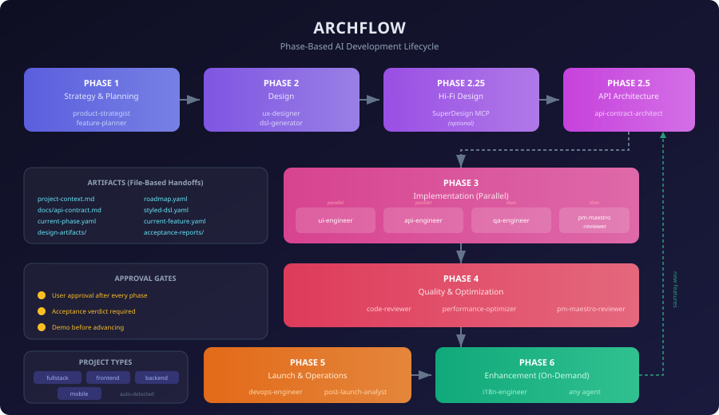

<div align="center">

<a name="archflow"></a>
<h1>
  
  Archflow
</h1>

**Turn Claude Code into a structured development team.**

[](https://opensource.org/licenses/MIT) [](https://docs.anthropic.com/en/docs/claude-code) [](https://github.com/AZidan/archflow) [](https://github.com/AZidan/archflow) [](#or-skip-the-terminal)

[Website](https://archflowai.dev/) · [Watch it work](https://www.youtube.com/@archflowai-dev) · [Quick Start](#quick-start) · [Three Ways to Start](#three-ways-to-start) · [Studio](#or-skip-the-terminal) · [Commands](#commands) · [How It Works](#how-it-works) · [Phases](#the-phases) · [Agents](#agents)



**[▶ Watch the 59-second overview](https://www.youtube.com/watch?v=sc2qEDnDeP0)** · or the [3-minute onboarding run](https://archflowai.dev/#start) on a real codebase

</div>

---

## What is Archflow?

Getting AI to write code stopped being the hard part. Keeping it coherent is. Sessions end and take their context with them. The frontend drifts from the backend. Two weeks in, nobody can say what's actually finished.

Archflow is a **phase-based AI development framework** for [Claude Code](https://docs.anthropic.com/en/docs/claude-code) that fixes this structurally, with 17 specialized agents working from product strategy through to production deployment.

Instead of one AI doing everything, each task goes to an agent with deep expertise in its domain. A `product-strategist` defines business goals. A `ux-designer` creates the design system. An `api-contract-architect` locks down API specs. Then `ui-engineer` and `api-engineer` build frontend and backend in parallel against that same contract, so they can't quietly disagree. Handoffs happen through files, not chat, so context outlives the session that created it.

Two things keep it practical rather than theoretical:

**It meets your codebase where it is.** A blank directory, an established codebase, or a prototype that outgrew itself: Archflow reads what already exists and picks up from there. It never assumes you're on day one.

**Ceremony scales with the project.** A solo weekend build runs in `quick` mode: one implicit release, gates that record but don't block. A team with a real release pipeline runs in `full` mode. Same schema either way, so switching costs nothing, and Archflow offers the upgrade when it notices you've outgrown the simpler mode.

Works with any project type (fullstack, frontend-only, backend-only, or mobile), adapting its phases, agents, and artifact structure to each.

---

## Quick Start

### 1. Add the Marketplace (one-time)

```bash
claude plugin marketplace add AZidan/archflow
```

### 2. Install the Plugin

```bash
claude plugin install archflow --scope project
```

This saves the plugin reference to `.claude/settings.json` in your repo, so any team member who clones gets prompted to install automatically.

Free and open source. No lock-in. Uninstall anytime with `claude plugin uninstall archflow`.

### 3. Open Claude Code in your project

```bash
cd your-project
claude
```

Then pick the entry point that matches where you actually are.

---

## Three Ways to Start

Whichever you pick, Archflow proposes and waits: every artifact is shown to you before it's written, and no phase advances without your approval. Your code is never modified during setup.

All three work from the terminal or from [Archflow Studio](#or-skip-the-terminal), which runs them for you in a browser.

### 1. New project: start from strategy

```
/archflow:init
```

Creates the state files and drops you at Phase 1. A `product-strategist` works out who this is for and what success means, a `feature-planner` turns that into a backlog, and you move through design → API contract → implementation with an approval gate at every step.

Starts in `quick` mode, so you get structure without ceremony until you ask for it.

📖 [Full guide: starting a new project](https://archflowai.dev/guides/new-project/)

### 2. Existing codebase: onboard it

```
/archflow:onboard
```

Dispatches up to 9 agents in parallel to read your codebase, imports context from tools you already use (Jira, Notion, Linear, GitHub, Confluence, Slack), and reverse-engineers the artifacts you never wrote down: design system, API contract, user flows, roadmap. Everything is presented for approval before anything is written.

It also works out which phase your project has reached, so you don't redo work that's already done.

▶ **[Watch a real repo get onboarded](https://archflowai.dev/#start)** (3m20s, unedited) · 📖 [Full guide: onboarding an existing codebase](https://archflowai.dev/guides/existing-codebase/)

### 3. From prototype to product

Your prototype works. People are using it. What it doesn't have is a roadmap, an API contract, a test plan, or a defensible answer to what "1.0" means.

```
/archflow:onboard
```

Onboarding audits what you shipped and **reconstructs the plan around it**. Where it finds working code with no story behind it, it writes the story and marks it delivered, so your roadmap opens reflecting reality instead of pretending nothing exists yet.

From there, the road to a real product is the phases a prototype skips:

| What a prototype usually lacks | Where it comes from |
|---|---|
| Product direction, personas, success metrics | Phase 1 |
| A design system instead of ad-hoc styling | Phase 2 |
| An API contract both sides build against | Phase 2.5 |
| Tests and acceptance criteria per story | Phase 3 |
| Security, code quality, and performance review | Phase 4 |
| CI/CD, versioning, app store prep, analytics | Phase 5 |

You stay in `quick` mode while it's still small. When Archflow spots growth signals (a second release, a second contributor, a size threshold) it *offers* `full` mode with explicit release planning and role-based gates. It never forces the upgrade.

**What this does and doesn't do:** it gives you the plan, contracts, and quality gates your prototype never had, and Phase 4 agents will review code quality, security, and performance. It will not silently rewrite your architecture. You decide what gets refactored; Archflow makes sure you know what needs it.

📖 [Full guide: taking a prototype to production](https://archflowai.dev/guides/prototype-to-product/)

---

## Then: Develop Features

```
/archflow:feature          # Interactive wizard
/archflow:feature login    # Quick-add by name or description
```

Archflow creates the feature branch, breaks it into tasks, and guides implementation through the appropriate agents. Features are filtered by scope: a `backend_only` repo only sees backend-scoped work.

Capture an idea without committing to it, and detail it later when it's next up:

```
/archflow:feature          # → capture as a backlog stub
/archflow:groom S2-11      # → add acceptance criteria, subtasks, gates
/archflow:feature S2-11    # → pull it into the active release and start building
```

---

## Or: Let It Run Unattended

```
/archflow:autopilot        # interview, then build the release's stories while you sleep
```

Autopilot is the unattended lane. It asks you everything it can't decide alone **up front, in one batch** (product behaviour, trade-offs, anything irreversible), then goes silent and builds story
after story, running QA and acceptance on each. One report at the end.

The part that makes it safe is what happens when a *new* blocker appears at 3am. It never guesses and
it never stalls the run: the story is **parked** with the open question and 2–4 candidate answers, the
work-in-progress stays committed but unmerged, and the run moves to the next story. A parked story
blocks the release until you answer.

Everything lands on one branch. **Autopilot never merges to `main`, never opens a PR, never ships**. You review a night's work in the morning and merge it yourself.

```
/archflow:autopilot --plan     # interview + show the queue, don't start
/archflow:autopilot resume     # answer the parked questions, pick up where it stopped
```

---

## Or: Skip the Terminal

```
/archflow:studio        # opens a local workspace at localhost:3456
```

Studio is a local web workspace over the same `.archflow/` files. The roadmap becomes a board, the
release becomes a pipeline, and the agents work in front of you instead of behind a scroll of text.

**It sets itself up.** Point it at a folder and Studio runs onboarding for you: the same nine agents,
the same approval gates, driven from a button instead of a prompt. A project still on the v1.0 schema
gets a one-button migration to v2.0, backup included. After the plugin install, the terminal is
optional.

**Its chat is your session, forked.** Open Studio from a running Claude Code session and its chat
starts with that conversation's history on a branch, so you don't re-explain the project to a second
assistant. Nothing you type in Studio lands back in your terminal. If no session context is found it
falls back to its own `claude` process and says so.

**Local, and only local.** Binds to `127.0.0.1` with an origin allowlist covering the WebSocket
upgrade. No cloud service, no telemetry, no account. Your code and your Claude credentials never
leave the machine.

The server is detached on purpose, so it outlives the session that started it and you can leave it
open beside your work.

```
/archflow:studio status     # is it running, and for which project?
/archflow:studio stop       # shut it down
/archflow:studio port 3457  # use a different port
```

Studio is what ships Studio: 4 releases and 71 stories so far, planned and driven from its own board.
It is marked beta because features are still landing, and because
[what you tell us is missing](https://github.com/AZidan/archflow/issues) decides which land next.

📖 [Full guide: using Archflow Studio](https://archflowai.dev/guides/studio/)

---

## How It Works

Building software with AI means context gets lost, quality varies, and the same mistakes repeat. Archflow fixes this with three ideas:

- **Specialized agents**: A UX designer doesn't write backend code. An API engineer doesn't make design decisions. 17 agents, each scoped to one domain.
- **File-based handoffs**: Context survives between conversations. Agents communicate through artifacts, not chat, so nothing gets lost when a session ends.
- **Phase gates**: 6 phases from strategy to deployment. Nothing moves forward without your approval. No skipped steps. No autonomous decisions on what ships. (`/archflow:autopilot` pre-authorizes those gates for one unattended run, and still stops short of `main`.)
- **Contract-first development**: API contracts are defined before implementation. Frontend and backend build against the same spec, so they never disagree.
- **Focused context**: Each phase loads only what the active agents need. Less noise, better results.
- **Acceptance testing**: Features aren't done until they pass acceptance testing against your roadmap criteria.

---

## The Phases

```
Phase 1    Strategy & Planning         product-strategist, feature-planner
Phase 2    Design                      ux-designer, dsl-generator
Phase 2.25 High-Fidelity Screens       SuperDesign MCP (optional)
Phase 2.5  API Architecture            api-contract-architect
Phase 3    Implementation (Parallel)   ui-engineer + api-engineer, qa-engineer, pm-reviewer
Phase 4    Quality & Optimization      code-reviewer, performance-optimizer, pm-reviewer
Phase 5    Launch & Operations         devops-engineer, post-launch-analyst
Phase 6    Enhancement (On-Demand)     i18n-engineer, post-launch-analyst, any agent as needed
```

Six numbered phases, plus two optional sub-phases: 2.25 needs the SuperDesign MCP server and can
be skipped entirely, and 2.5 is skipped for projects with no API. That is why you will see both
"6 phases" and eight phase files.

Each phase has explicit completion criteria, expected output artifacts, and requires user approval
before advancing.

---

## Inside `/archflow:onboard`

Most AI workflows assume you're starting from scratch. This is the one that doesn't, and it's the engine behind both the *existing codebase* and *prototype to product* paths above.

```
Phase A: Interactive Collection     Answer 5 questions about your stack and context sources

Phase B: Autonomous Agent Dispatch  Up to 9 agents analyze your codebase in parallel:
                                    codebase audit → doc deep-dive → design extraction →
                                    route/API extraction → product-strategist → ux-designer →
                                    api-contract-architect → dsl-generator → feature-planner

Phase C: Synthesis & Presentation   Artifacts generated and presented for your approval
```

The onboarding agents generate ready-to-use `project-context.md`, `roadmap.yaml`, `backlog.yaml`, `api-contract.md`, `theme.yaml`, `styled-dsl.yaml`, and `user-flows.md`, all reverse-engineered from your existing code and imported documentation. It also creates or updates your project's `CLAUDE.md` with architecture context derived from the analysis.

Two things make the result honest rather than aspirational: reconciliation moves any story whose code already exists into a shipped release, and the **gap report** tells you plainly what's missing: no tests, no contract, no design system, so you're choosing what to fix rather than discovering it later.

---

## Agents

| Phase | Agents |
|-------|--------|
| 1. Strategy & Planning | `product-strategist`, `feature-planner` |
| 2. Design | `ux-designer`, `dsl-generator` |
| 2.25 High-Fidelity (optional) | SuperDesign MCP |
| 2.5 API Architecture | `api-contract-architect` |
| 3. Implementation | `ui-engineer`, `api-engineer`, `qa-engineer`, `pm-reviewer` |
| 4. Quality & Optimization | `code-reviewer`, `performance-optimizer`, `pm-reviewer` |
| 5. Launch & Operations | `devops-engineer`, `post-launch-analyst` |
| 6. Enhancement | `i18n-engineer`, any agent as needed |

---

## Commands

Every command is namespaced `/archflow:<name>`. You'll use three of them regularly.

**Getting set up**: run once per project

| Command | What it does |
|---------|-------------|
| `/archflow:init` | Initialize a new project at Phase 1 |
| `/archflow:onboard` | Analyze an existing codebase and generate all artifacts |
| `/archflow:design` | The design system every UI agent builds against (set once), or one story's screens (`/archflow:design S7-20`). Shows the current choice with no args) |
| `/archflow:setup-mcp` | Connect external tools (Jira, Notion, Linear, GitHub, etc.) |
| `/archflow:migrate` | Upgrade a v1.0 project to schema v2.0 (releases replace phases) |

**Day to day**: the ones you'll actually type

| Command | What it does |
|---------|-------------|
| `/archflow:status` | Current phase, active release, progress, and what to run next |
| `/archflow:feature` | Add a story: to the backlog, or straight into the active release with a branch |
| `/archflow:groom` | Detail or refine a story: a backlog stub into `ready`, or one already in a release with its gates re-derived |
| `/archflow:contract` | The API contract architecture, or one story's endpoints |
| `/archflow:issue` | Record a defect on a story being built, see what is open, or defer a minor one to the backlog |
| `/archflow:doctor` | Check the environment and project state. `--fix` repairs drift after a plugin upgrade |
| `/archflow:studio` | Open the visual workspace over the same files (beta) |

**Planning and pace**: when the project grows

| Command | What it does |
|---------|-------------|
| `/archflow:release` | Inspect and manage releases (`new`, `start`, `ship`) |
| `/archflow:mode` | Show or switch ceremony mode (`quick` \| `full`) |
| `/archflow:autopilot` | Build the release's queued stories unattended on one branch |

Run `/archflow:status` any time you've lost the thread: it reports where the project stands and what's sensible to do next.

---

## Project Types

Archflow detects and adapts to your project type:

| Type | Frontend Agent | Backend Agent | Notes |
|------|---------------|---------------|-------|
| `fullstack` | Yes | Yes | Parallel frontend/backend development |
| `frontend_only` | Yes | No | Pages, components, flows |
| `backend_only` | No | Yes | Endpoints, services, modules |
| `mobile` | Yes | Yes | React Native, SwiftUI, or Jetpack Compose |

Phase instructions, agent selection, audit checks, and roadmap structure all adapt to the project type.

---

## Git Workflow

Archflow uses a structured branching strategy:

```
main
 └── feature/user-auth              (feature branch)
      ├── user-auth/login-form       (task branch)
      ├── user-auth/auth-api         (task branch)
      └── user-auth/session-mgmt     (task branch)
```

- Feature branches from `main`
- Task branches from the feature branch
- Merges only happen after explicit user approval
- Feature completion triggers cleanup and roadmap updates

---

## Key Artifacts

Archflow manages these files in your project:

| File | Purpose |
|------|---------|
| `.archflow/project-context.md` | Business goals, tech stack, architecture decisions |
| `.archflow/roadmap.yaml` | Index: epic labels, release pipeline, ceremony mode |
| `.archflow/backlog.yaml` | Unscheduled scope: stubs and groomed `ready` stories |
| `.archflow/releases/{slug}.yaml` | Stories committed to a release, with gates and acceptance criteria |
| `.archflow/history.yaml` | What shipped, when, and which files it touched |
| `.archflow/current-phase.yaml` | Where the project is: phase, mode, active release |
| `.archflow/project-settings.yaml` | How the project works: type, stack, contract path, optional agents |
| `.archflow/current-feature.yaml` | Active feature scope and task tracking |
| `docs/api-contract.md` | API specifications (single source of truth). Path is configurable via `api_contract_path` |
| `design-artifacts/styled-dsl.yaml` | Component specifications with styling |
| `design-artifacts/theme.yaml` | Design system tokens |
| `design-artifacts/wireframes/` | Screen layouts |
| `docs/acceptance-reports/` | End-to-end acceptance results and verdicts |

---

<details>
<summary><strong>File Structure</strong></summary>

Archflow is distributed as a Claude Code plugin marketplace. The plugin contains all framework code; your project only stores state files.

### Marketplace (this repo)

```
archflow/
├── .claude-plugin/marketplace.json  # Marketplace registry
├── CHANGELOG.md                     # Release history
├── CONTRIBUTING.md                  # How to add an agent, command or schema
├── SECURITY.md                      # Pinning policy, untrusted content, shell surface
├── .github/workflows/ci.yml         # Mirror check, schema validation, tests
├── tests/                           # Framework tests + fixture projects
├── plugin/                          # Installable plugin
│   ├── .claude-plugin/plugin.json   # Plugin manifest
│   ├── hooks/                       # SessionStart, PreToolUse guard, Stop check
│   │   ├── hooks.json               #   registration for both
│   │   └── studio-session-context.mjs #  publishes session id/cwd for Studio companion mode
│   ├── agents/                      # 17 specialized agent definitions (the ONLY agents tree)
│   ├── commands/                    # Slash commands (namespaced /archflow:<name>)
│   │   ├── status.md                # /archflow:status
│   │   ├── init.md                  # /archflow:init
│   │   ├── onboard.md               # /archflow:onboard
│   │   ├── migrate.md               # /archflow:migrate
│   │   ├── mode.md                  # /archflow:mode
│   │   ├── release.md               # /archflow:release
│   │   ├── groom.md                 # /archflow:groom
│   │   ├── feature.md               # /archflow:feature
│   │   ├── autopilot.md             # /archflow:autopilot
│   │   ├── design.md                # /archflow:design
│   │   ├── contract.md              # /archflow:contract
│   │   ├── issue.md                 # /archflow:issue
│   │   ├── doctor.md                # /archflow:doctor
│   │   ├── studio.md                # /archflow:studio
│   │   └── setup-mcp.md             # /archflow:setup-mcp
│   ├── scripts/migrate.py           # v1.0 → v2.0 migration engine (used by /archflow:migrate)
│   ├── server/server.mjs            # Archflow Studio server bundle (built elsewhere, see below)
│   ├── dist/                        # Archflow Studio web UI (built elsewhere, see below)
│   └── skills/archflow/             # Framework knowledge + assets copied into projects
│       ├── SKILL.md                 # Overview skill (what Archflow is, where things live)
│       ├── instructions.md          # Core instructions (copied to .archflow/, reloaded via hook)
│       ├── workflow.md              # Git branching strategy
│       ├── phases/                  # Phase-specific instruction files (10 files)
│       ├── schemas/                 # roadmap / release / backlog / history / autopilot schemas
│       ├── design-systems/          # One markdown file per design system + examples/ screenshots
│       │                            #   material3 · liquid-glass · shadcn · fluent2 · custom-tokens
│       ├── base-dsl-structure.yaml  # DSL template for design artifacts
│       └── mcp-registry.yaml        # Curated MCP server registry
├── README.md
└── LICENSE
```

### Project (created by `/archflow:onboard` or Phase 1 setup)

```
your-project/
├── .archflow/                       # Project state (version-controlled)
│   ├── current-phase.yaml           # Where the project is (cursor)
│   ├── project-settings.yaml        # How the project works (settings)
│   ├── design-system.yaml           # The chosen design system (name, platform, library, theme)
│   ├── design-systems/              # The design-system reference files, copied from the plugin
│   ├── project-context.md           # Business goals, tech stack, architecture
│   ├── roadmap.yaml                 # Index: epics, release pipeline, mode
│   ├── backlog.yaml                 # Unscheduled scope (stubs + groomed stories)
│   ├── releases/                    # One file per release; archive/ for shipped
│   ├── history.yaml                 # Shipped ledger (institutional memory)
│   └── current-feature.yaml         # Active feature scope and tasks
├── .claude/settings.json            # Plugin reference (auto-created on install)
└── CLAUDE.md                        # Updated with Archflow section by onboarding
```

</details>

<details>
<summary><strong>External Tool Integration</strong></summary>

The `/archflow:setup-mcp` command configures MCP servers to connect with your existing tools:

| Tool | Transport | Purpose |
|------|-----------|---------|
| Jira | HTTP/OAuth | Import epics, stories, sprint data |
| Confluence | HTTP/OAuth | Import documentation |
| Notion | HTTP/OAuth | Import pages and databases |
| Linear | HTTP/OAuth | Import issues, projects, cycles |
| GitHub | HTTP/OAuth | Import issues, PRs, project boards |
| Google Drive | stdio/OAuth | Import Google Docs and Sheets |
| Slack | HTTP/OAuth | Import context from channels/threads |
| Trello | stdio/env | Import boards, lists, cards |

These integrations are primarily used during `/archflow:onboard` to pull existing project context into Archflow's format.

</details>

---

## Requirements

### Required

| Tool | Why | Used by |
|---|---|---|
| [Claude Code CLI](https://docs.anthropic.com/en/docs/claude-code) | Archflow is a Claude Code plugin | Everything |
| Git | Branch-per-story workflow, release tags, the ship ritual | All phases |
| Node.js 18+ | Archflow Studio and the `SessionStart` hook that ships with the plugin; some MCP servers too | Studio, hooks |

### Recommended

**[codemap](https://github.com/AZidan/codemap) — token optimization.** Archflow's agents navigate
your codebase through a structural index instead of reading whole files: `codemap find` locates a
symbol, `codemap show` gives a file's shape, and the agent then reads only the line ranges it needs.
On a real codebase that cuts token consumption on navigation by roughly 60-80%, which is the
difference between a story that fits in one context window and one that does not.

```bash
pip install "git+https://github.com/AZidan/codemap.git@v1.3.1"
```

Archflow works without it. Every agent falls back to ordinary file search, and you will simply pay
more tokens per story. Run `/archflow:doctor` to see what is installed.

### Per project type

| Tool | Why | Needed for |
|---|---|---|
| Python 3 + PyYAML | Runs the v1.0 to v2.0 migration script | `/archflow:migrate` only |
| An end-to-end test runner | `pm-reviewer` verifies acceptance criteria against the running app | `fullstack`, `frontend_only`, `mobile` |

Archflow does not pick your e2e tool and never installs one. `pm-reviewer` uses whatever the project
already has — Playwright, Cypress, Detox, XCUITest, Espresso, Maestro, or a backend HTTP test stack.
If a project has none, it stops and asks you to choose rather than deciding for you.

### Supply chain

Everything Archflow can install from outside your machine is listed here, pinned to an immutable
ref. Nothing installs without asking you first.

| Artifact | Source | Pin | Used by |
|---|---|---|---|
| codemap | `github.com/AZidan/codemap` | `v1.3.1` (`7e24f23ecbc7`) | Optional token optimization, all phases |
| superdesign-mcp-claude-code | `github.com/AZidan/superdesign-mcp-claude-code` | `1bd2d1766b1e` | Phase 2.25 hi-fi screens (optional phase) |

A `git+https://` or `npx github:` reference without a `@<ref>` or `#<ref>` tracks a moving branch,
which means a compromise upstream reaches every user on their next install. If you edit one of those
lines, keep the pin.

codemap is pinned to a **release tag** because it publishes releases. A tag is readable but mutable,
so the commit it must resolve to is recorded beside it. Verify with:

```bash
git ls-remote https://github.com/AZidan/codemap.git 'refs/tags/v1.3.1^{}'
# expect 7e24f23ecbc74165d5d980b020fb69aa23d6cd95
```

superdesign-mcp-claude-code publishes no releases, so it stays pinned to a raw commit. To move
either to a newer version, update the ref here, at the install site and in `SECURITY.md`, and note
it in the changelog.

Archflow never auto-updates either of these.

### What Archflow runs on your machine

Archflow drives Claude Code, so everything runs as ordinary tool calls you can see and approve:

- **Git** — branch, commit, tag, and read history. It never merges to `main`; that stays yours.
- **File writes** — inside `.archflow/`, `docs/`, `design-artifacts/`, and your source tree.
- **Project commands** — your own test, build and lint scripts.
- **One optional background process** — `codemap watch`, which keeps the index current. It is
  opt-in, it starts only if codemap is installed, and `pkill -f "codemap watch"` stops it.
- **An upgrade notice.** When the plugin updates ahead of your project's `.archflow/`, a
  `SessionStart` hook says so before your first command, names what drifted, and points at
  `/archflow:doctor --fix`. It goes quiet once the project is repaired.
- **Two guard hooks, scoped to Archflow projects.** In a directory with an `.archflow/`, a
  `PreToolUse` hook blocks a force-push to `main`, and any push, checkout or merge touching `main`
  while an unattended `/archflow:autopilot` run is live. In any other repo it exits immediately and
  changes nothing. A `Stop` hook warns when state files have drifted from their schemas. Both fail
  open, so a bug in a guard can never break your session.

External code it can install is listed under [Supply chain](#supply-chain), and nothing there
installs without asking you first.

Archflow Studio additionally needs the `claude` binary on your `PATH`, which you already have if
Claude Code works, and a project on schema v2.0. A v1.0 project opens read-only until you take the
one-button migration Studio offers.

Archflow Studio additionally needs the `claude` binary on your `PATH`, which you already have if
Claude Code works, and a project on schema v2.0. A v1.0 project opens read-only until you take the
one-button migration Studio offers.

---

## Contributing

See [CONTRIBUTING.md](CONTRIBUTING.md) for setup, the mirrored-tree rule, how to add an agent or a
command, and what an agent must never contain. Participation is covered by our
[Code of Conduct](CODE_OF_CONDUCT.md), and security reports go through [SECURITY.md](SECURITY.md).
Release history is in [CHANGELOG.md](CHANGELOG.md).


**Archflow Studio's files are generated, not authored here.** `plugin/server/`, `plugin/dist/`,
`plugin/commands/studio.md` and `plugin/hooks/studio-session-context.mjs` are built in the
[archflow-studio](https://github.com/AZidan/archflow-studio) repo and copied in by its
`npm run sync:plugin`. Edits made directly in this repo are overwritten on the next sync. Run
`npm run sync:plugin -- --check` there to detect drift. This adds roughly 5.6 MB to the plugin for
everyone, including people who never open Studio, which is a deliberate tradeoff for one namespace
and one install.


Contributions are welcome. Areas of interest:

- **New agents**: Add specialized agents in `plugin/agents/` following the existing format, and
  wire them into a phase file — an agent that no phase references can never be dispatched
- **Phase improvements**: Refine phase instructions in `.archflow/phases/`
- **MCP registry**: Add tool integrations in `skills/archflow/mcp-registry.yaml`
- **Bug fixes**: Open an issue or submit a PR

---

## Community & Support

- **Bug reports:** [GitHub Issues](https://github.com/AZidan/archflow/issues)
- **Feature requests:** [GitHub Issues](https://github.com/AZidan/archflow/issues)
- **Questions:** [GitHub Discussions](https://github.com/AZidan/archflow/discussions)

---

## License

MIT License. See [LICENSE](LICENSE) for details.

---

<div align="center">

**Archflow: Because building software deserves structure, not chaos.**

[Back to top](#archflow)

</div>
