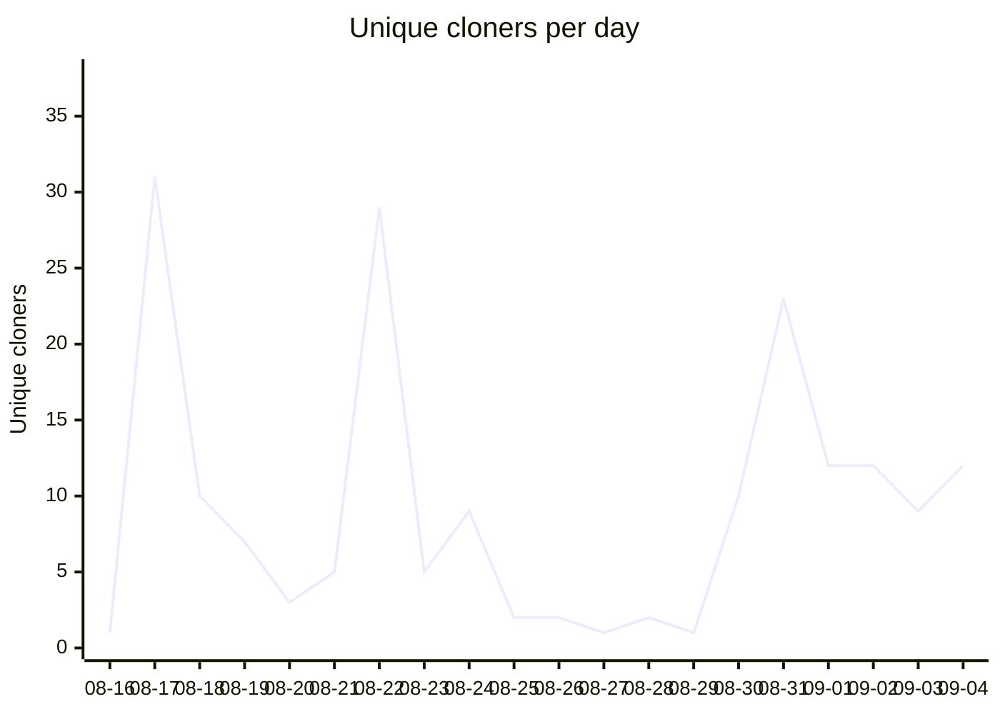

# Traffic metrics

Auto-generated by [`.github/workflows/traffic-metrics.yml`](../.github/workflows/traffic-metrics.yml).
Do not edit by hand — changes are overwritten on the next run.

GitHub retains only 14 days of traffic data, so these snapshots are the permanent
record. Clone counts are the closest available proxy for plugin installs: a
`/plugin marketplace add` is a `git clone`, and Anthropic publishes no install stats.

Last updated: 2026-09-05 · window shown: 2026-08-16 → 2026-09-04

## Unique cloners per day

## Totals

| Window | Clones | Unique cloners |
|---|---:|---:|
| Last 7 days | 128 | 79 |
| Last 30 days | 557 | 186 |

Unique cloners is a *per-day* figure, so these column totals double-count anyone
who cloned on more than one day — read them as an upper bound, not a headcount.

A high clones-to-uniques ratio (~10:1) indicates automation; roughly 1–2:1 is
human traffic. Raw data: [`traffic.csv`](traffic.csv), [`referrers.csv`](referrers.csv).
